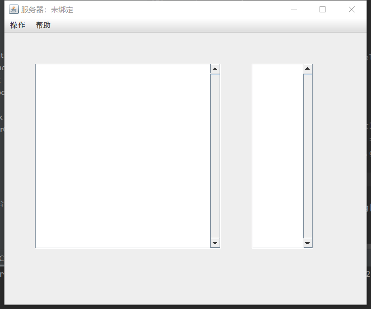

# JavaChat
简单的多人聊天程序

## 功能演示

*服务器端 未绑定页面和端口绑定页面*

|  |  |
| ---------------- | ---------------- |

*服务器 已绑定端口页面和成功解除窗口绑定*

|  |  |
| ---------------- | ---------------- |

*客户端 未登录页面和服务器信息设置页面*

|  |  |
| ---------------- | ---------------- |

*客户端 登录页面和注册页面*

|  |  |
| ---------------- | ---------------- |

*客户端 登录成功提示和注册成功提示*

|  |  |
| ---------------- | ---------------- |

*客户端 登录成功后显示最近10条消息和取消登录成功提示*

|  |  |
| ---------------- | ---------------- |

*客户端 操作错误提示（部分）*

|  |  |
| ---------------- | ---------------- |
|  |  |
|  |  |

*客户端 登录后发送新消息 和 服务器 接收到发送的消息与显示目前在线用户*

|  |  |
| ---------------- | ---------------- |

## 开源声明

基于GPL 2.0协议开源，如您使用到了本仓库中的代码，请遵循协议要求开源。

## 更新记录

2023-03-22 创建仓库
